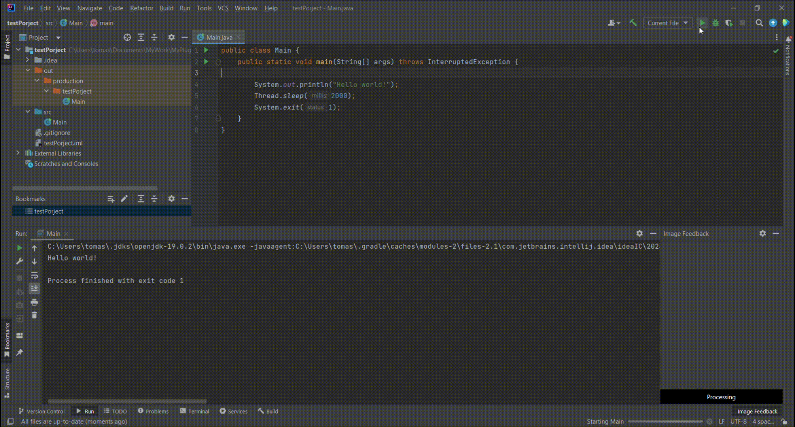
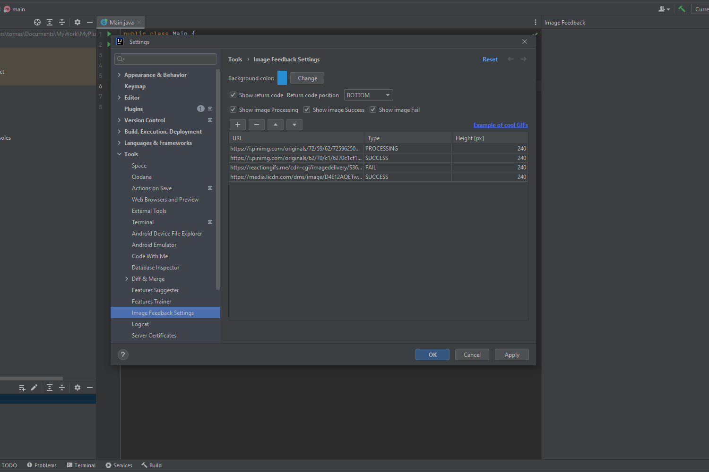

# Image Execution Feedback

Spice up your coding experience with humorous GIFs and images! A random image from customizable list is shown in a
new tool window. Images are shown based on return code of your execution.

Share your cool GIFs settings in <a href="https://github.com/tomash1234/jbplugin-ImageFeedback/issues/1">this issue</a>.

## Settings

1. Open Settings (File -> Settings)
2. Click on Tools -> Image Feedback Settings
3. Click on Add and enter URL to an image, type and preferred height
4. Add as many images as you want
5. Click on Apply
6. Run your code

### Types:
- Type **PROCESSING**: image is shown when execution is running 
- Type **SUCCESS**: image is shown when return code is 0
- Type **FAIL**: image is shown when return code is not 0

## Notes
- If there is more images of a type, random image is selected
- Images are downloaded for the first time during session then they are cached.

